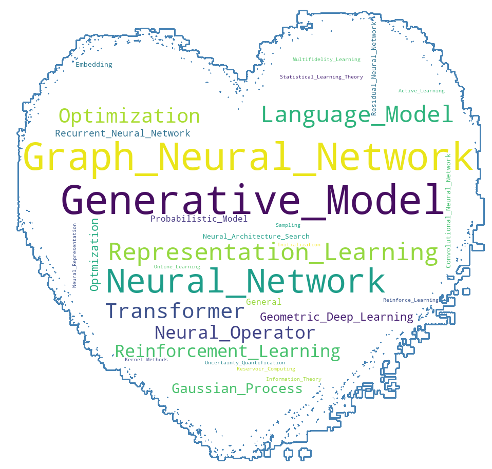
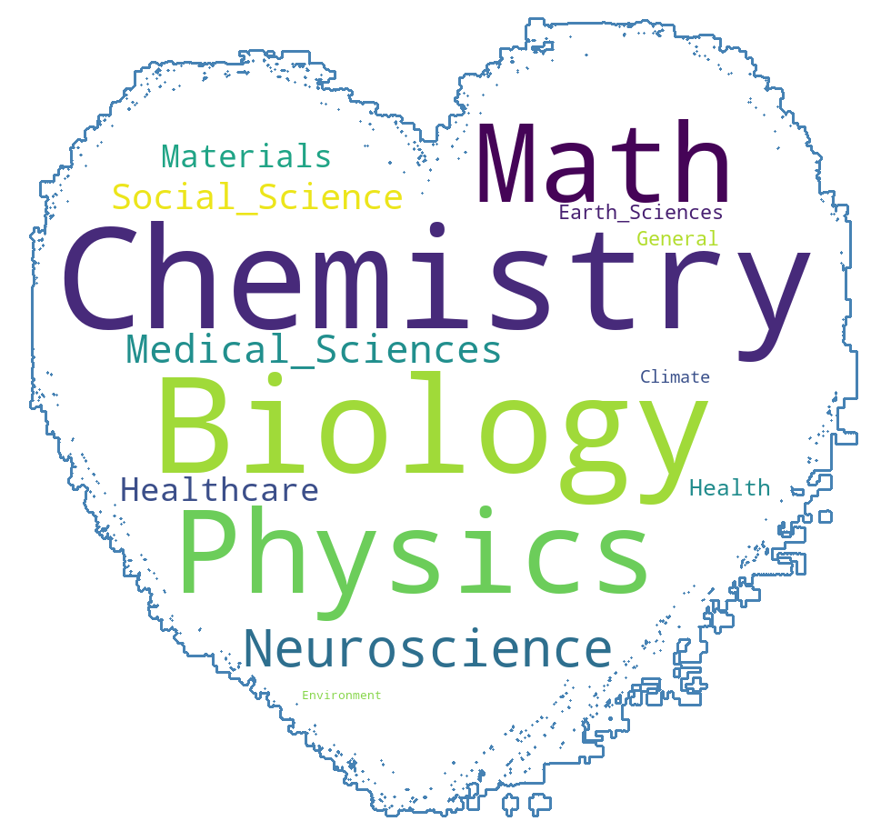
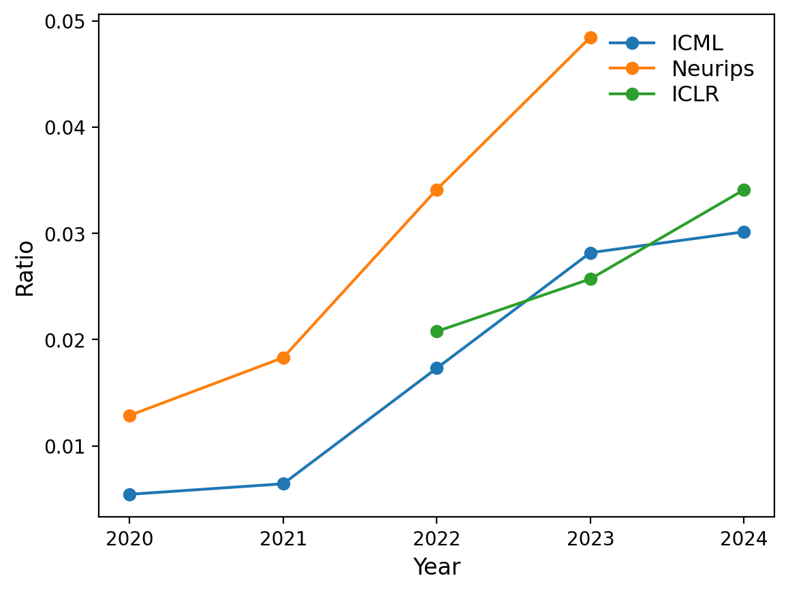
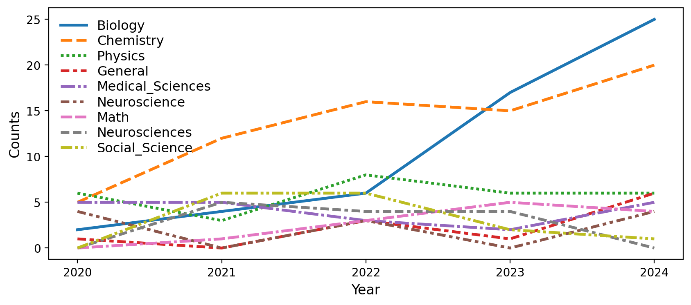

# AI for Science paper collection

This is a new initiative by [AI for Science Community](https://ai4sciencecommunity.github.io/) to collect papers published in AI for Science areas and categorize them by subjects, years, venues and keywords, etc. 

Each `.csv` file contains the correponding list of each year. Currently, the paper list is labelled by keys of `Title`, `Conference`, `Type`, `Application`, `MLTech`, `OpenReviewLink`. One could visulalize the list directly on this GitHub repo or by `pandas`. 

## Covered venues
*1. International Conference on Machine Learning (ICML)*
- [ICML 2024](icml/icml_2024.csv): Total 2640 
- [ICML 2023](icml/icml_2023.csv): Total 1908 
- [ICML 2022](icml/icml_2022.csv): Total 1237
- [ICML 2021](icml/icml_2021.csv): Total 1189
- [ICML 2020](icml/icml_2020.csv): Total 1087

*2. Annual Conference on Neural Information Processing Systems (NeurIPS)*
- [NeurIPS 2023](neurips/neurips_2023.csv): Total 3584 
- [NeurIPS 2022](neurips/neurips_2022.csv): Total 2911
- [NeurIPS 2021](neurips/neurips_2021.csv): Total 2342
- [NeurIPS 2020](neurips/neurips_2020.csv): Total 1909 

*3. International Conference on Learning Representations (ICLR)*
- [ICLR 2024](iclr/iclr_2024.csv): Total 2321
- [ICLR 2023](iclr/iclr_2023.csv): Total 1590 
- [ICLR 2022](iclr/iclr_2022.csv): Total 1103
- [ICLR 2021](iclr/iclr_2021.csv): Total 868
- [ICLR 2020](iclr/iclr_2020.csv): Total 695

## Contribution guideline
We are gradually adding the results from past top conferences and welcome volunteers to contribute to this page!
You could contribute to this page by creating a PR on (1) updating a current `.csv` (2) contributing a new `.csv` for an uncovered conference/year

If you want to join the team, please contact <a href="mailto:sherrylixuecheng@google.com">Lixue Cheng</a>.

## Word clouds

  
  

## Trends
(1) AI for Science papers increase every year

  

(2) Trends of different applications

  

